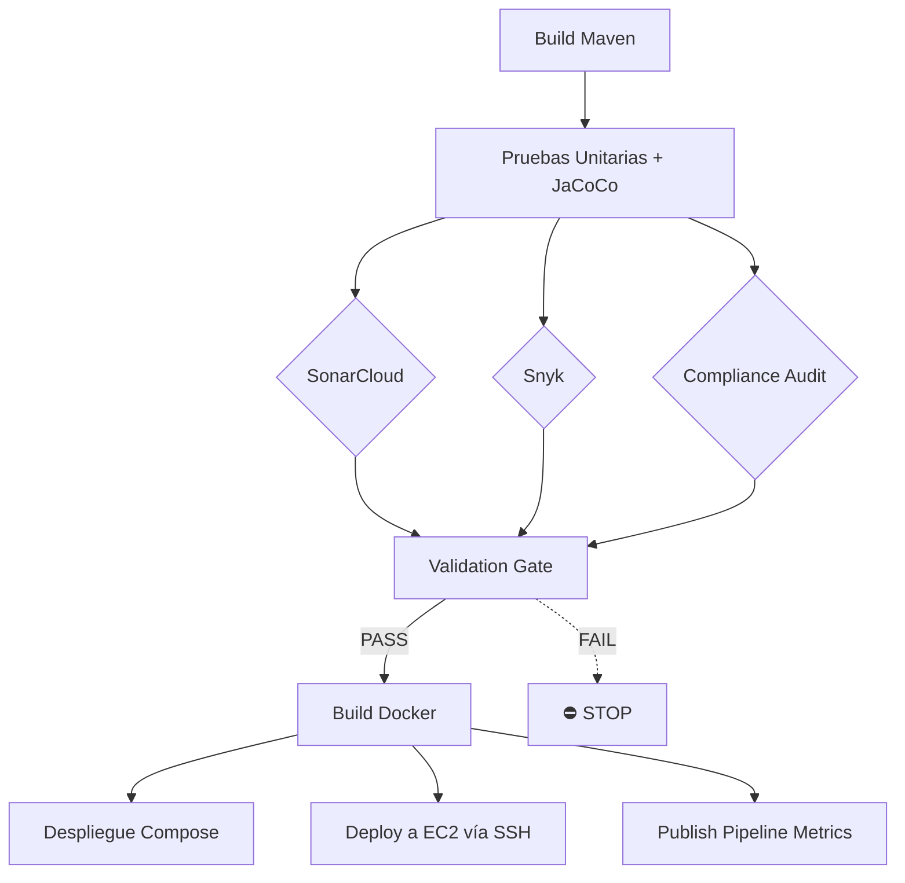

# 🚀 Microservicio Auth — Pipeline DevOps con Observabilidad

> **Evaluación Parcial N°3 · DOY0101 Ingeniería DevOps**
> *Observabilidad y entornos reales en DevOps*
> Extensión del pipeline CI/CD con monitoreo, métricas, dashboards,
> AWS EC2 y políticas de cumplimiento automatizadas.

---

## 📋 Tabla de Contenidos

- [Descripción del Proyecto](#descripción-del-proyecto)
- [Tecnologías Utilizadas](#tecnologías-utilizadas)
- [Estructura del Repositorio](#estructura-del-repositorio)
- [Arquitectura del Pipeline CI/CD](#arquitectura-del-pipeline-cicd)
- [IE1 — Monitoreo con CloudWatch + Prometheus](#ie1--monitoreo-con-cloudwatch--prometheus)
- [IE2 — Despliegue en AWS EC2 (GitHub Actions)](#ie2--despliegue-en-aws-ec2-github-actions)
- [IE3 — Dashboards con Grafana](#ie3--dashboards-con-grafana)
- [IE4 — Documentación de Integración](#ie4--documentación-de-integración)
- [IE5 — Políticas de Cumplimiento](#ie5--políticas-de-cumplimiento)
- [IE6 — Validación e Interrupción del Pipeline](#ie6--validación-e-interrupción-del-pipeline)
- [Trazabilidad y Calidad](#trazabilidad-y-calidad)
- [Secrets Requeridos](#secrets-requeridos)
- [Ejecución Local](#ejecución-local)
- [Conclusiones Personales](#conclusiones-personales)
- [Uso de Inteligencia Artificial](#uso-de-inteligencia-artificial)

---

## Descripción del Proyecto

Este repositorio implementa un pipeline **DevOps completo** para el
microservicio de autenticación (`microservicio-auth`), incluyendo:

1. **CI/CD clásico** (Evaluación Parcial N°2): build, tests, análisis de
   seguridad, contenedorización y despliegue con Docker Compose.
2. **Observabilidad** (Evaluación Parcial N°3 — IE1): instrumentación con
   Micrometer, exportación a Prometheus y AWS CloudWatch, logs JSON
   estructurados.
3. **Despliegue continuo** (IE2): despliegue automatizado directo a una
   instancia AWS EC2 vía SSH, ejecutado desde el propio pipeline.
4. **Dashboards** (IE3): Grafana con métricas de tiempo de despliegue,
   cobertura, CPU/memoria y errores.
5. **Cumplimiento** (IE5): SonarCloud, Snyk, CODEOWNERS, branch protection
   rules y script de auditoría automatizado.
6. **Validación robusta** (IE6): gate final que detiene el pipeline ante
   cualquier falla crítica, con demo de inyección de fallas.

El pipeline corre en **GitHub Actions** y ejecuta los siguientes jobs
en secuencia:

```
build → tests → ┬─ sonar ─┐
                ├─ snyk  ─┤
                └─ audit ─┘
                       ↓
                 validation-gate (IE6)
                       ↓
            ┌──────────┴──────────┐
            ↓                     ↓
     build-docker          publish-metrics
            ↓                     ↓
   ┌────────┴────────┐
   ↓                 ↓
despliegue       deploy-ec2 (SSH)
simulado
(Compose)
```

---

## Tecnologías Utilizadas

| Categoría | Herramienta | Versión | Indicador |
|---|---|---|---|
| Lenguaje | Java | 21 (Temurin) | — |
| Build | Maven | 3.9.x | — |
| Framework | Spring Boot | 3.4.3 | — |
| Contenedor | Docker | multi-stage | IE2 |
| Orquestación local | Docker Compose | 3.8 | IE2 |
| Despliegue Cloud | AWS EC2 + SSH | — | **IE2** |
| CI/CD | GitHub Actions | — | IE6 |
| Calidad de código | SonarCloud + JaCoCo | — | IE5 |
| Seguridad deps | Snyk | 1.1297.1 | IE5 |
| **Observabilidad** | **Micrometer + Prometheus + CloudWatch** | — | **IE1** |
| **Visualización** | **Grafana + Loki** | 10.4.0 | **IE3** |
| **Auditoría** | **script bash + CODEOWNERS** | — | **IE5** |
| Dependencias | Dependabot | — | IE5 |
| Cobertura | JaCoCo | 0.8.12 | IE3 + IE5 |

---

## Estructura del Repositorio

```
gitflow-encargo/
├── .github/
│   ├── CODEOWNERS                          # IE5 — revisores automáticos
│   ├── BRANCH_PROTECTION.md                # IE5 — doc de reglas
│   └── workflows/
│       ├── ci-cd.yml                       # Pipeline principal (todos los IE)
│       ├── failure-injection.yml           # IE6 — demo de inyección de fallas
│       └── cy.yml                          # Pipeline básico
├── observability/                          # IE1 + IE3 — stack de observabilidad
│   ├── prometheus/
│   │   ├── prometheus.yml
│   │   └── alerts.yml
│   └── grafana/
│       ├── datasources/prometheus.yml
│       └── dashboards/
│           ├── dashboard-auth-microservice.json
│           ├── dashboard-cicd-metrics.json
│           └── provider.yml
├── scripts/                                # IE5 — scripts de auditoría
│   ├── audit-compliance.sh
│   └── inject-failure.sh
├── src/
│   ├── main/java/com/encargo/microservicio/
│   │   ├── MicroservicioApplication.java
│   │   ├── config/MetricsConfig.java       # IE1 — métricas custom
│   │   ├── controller/AuthController.java  # IE1 — instrumentado
│   │   ├── model/Usuario.java
│   │   └── service/AuthService.java
│   ├── main/resources/
│   │   ├── application.properties          # IE1 — expone endpoints
│   │   └── logback-spring.xml              # IE1 — logs JSON
│   └── test/java/com/encargo/microservicio/
├── Dockerfile                              # multi-stage + healthcheck
├── docker-compose.yml                      # microservicio + prometheus + grafana
├── pom.xml                                 # Spring Boot + Micrometer + CloudWatch
└── README.md
```

---

## Arquitectura del Pipeline CI/CD



---

## IE1 — Monitoreo con CloudWatch + Prometheus

### Configuración

El microservicio expone los siguientes endpoints de observabilidad
(configurados en `src/main/resources/application.properties`):

| Endpoint | Propósito |
|---|---|
| `/actuator/health` | Health check (Docker + K8s probes) |
| `/actuator/health/liveness` | K8s livenessProbe |
| `/actuator/health/readiness` | K8s readinessProbe |
| `/actuator/prometheus` | Formato Prometheus scrape |
| `/actuator/metrics` | Métricas en JSON |
| `/actuator/info` | Info del microservicio |

### Métricas exportadas

**JVM auto-generadas (Micrometer + Spring Boot Actuator):**
- `jvm_memory_used_bytes`, `jvm_memory_max_bytes`
- `process_cpu_usage`, `process_uptime_seconds`
- `http_server_requests_seconds_*` (latencia + throughput)

**Custom del dominio (definidas en `config/MetricsConfig.java`):**
- `auth_login_attempts_total{result="success|failure"}` — Counter
- `auth_login_duration_seconds` — Timer con percentiles p50/p95/p99
- `auth_tokens_issued_total` — Counter

### Exportación a AWS CloudWatch

Spring Boot envía métricas a CloudWatch automáticamente gracias a:

```xml
<dependency>
    <groupId>io.micrometer</groupId>
    <artifactId>micrometer-registry-cloudwatch</artifactId>
</dependency>
```

Configuración (variable de entorno):
```bash
AWS_REGION=us-east-1
management.metrics.export.cloudwatch.namespace=microservicio-auth
management.metrics.export.cloudwatch.step=1m
```

Las métricas aparecen en CloudWatch bajo el namespace `microservicio-auth`.

### Logs estructurados

`src/main/resources/logback-spring.xml` define dos appenders:
- **CONSOLE**: texto plano (desarrollo local)
- **JSON_FILE**: formato JSON compatible con CloudWatch Logs Insights, Loki y ELK

Campos por línea de log: `timestamp`, `level`, `logger`, `message`, `service`, `traceId`, `spanId`.

### Verificación

```bash
# Iniciar el stack completo
docker compose up -d

# Ver métricas en formato Prometheus
curl http://localhost:8080/actuator/prometheus | head -30

# Filtrar métrica específica
curl http://localhost:8080/actuator/prometheus | grep auth_login
```

---

## IE2 — Despliegue en AWS EC2 (GitHub Actions)

### Estrategia de despliegue

El microservicio se despliega directamente en una instancia **AWS EC2**
mediante el job `deploy-ec2` del workflow `ci-cd.yml`, que se conecta por
SSH usando la acción `appleboy/ssh-action`. No se usa orquestación
(Kubernetes/kind): el despliegue es un *rolling update* simple a nivel de
contenedor Docker sobre una sola instancia.

### Características del despliegue

```bash
# En la instancia EC2, el job ejecuta (resumido):
docker login -u "$DOCKER_USERNAME" --password-stdin
docker pull "$DOCKER_USERNAME/microservicio-auth:sha-$GITHUB_SHA"

docker rename auth_api auth_api_old   # conserva el contenedor anterior
docker run -d --name auth_api --restart always -p 8080:8080 \
  "$DOCKER_USERNAME/microservicio-auth:sha-$GITHUB_SHA"

# Si el nuevo contenedor no pasa el healthcheck, se revierte
# automáticamente al contenedor anterior (auth_api_old).
```

| Característica | Detalle |
|---|---|
| Conexión | SSH (`appleboy/ssh-action`) con clave privada en secret |
| Imagen | Tag inmutable por commit: `sha-<github.sha>` |
| Rollback | Automático si el contenedor nuevo no queda `healthy` |
| Healthcheck | Definido en el `Dockerfile` (`/actuator/health`) |
| Validación post-deploy | `curl` al endpoint de salud desde el runner |
| Persistencia | `--restart always`: el contenedor revive si la instancia reinicia |
| Evidencia | Artefacto `ec2-deploy-evidence` con host, imagen y commit |

### Despliegue en GitHub Actions

El job `deploy-ec2` del workflow `ci-cd.yml`:

1. Se conecta a la instancia EC2 por SSH con las credenciales en secrets
2. Hace `docker login` y `docker pull` de la imagen recién publicada
3. Renombra el contenedor en ejecución (`auth_api` → `auth_api_old`)
4. Levanta el nuevo contenedor con `docker run`
5. Espera hasta 60s a que el `HEALTHCHECK` del Dockerfile marque `healthy`
6. Si falla, revierte al contenedor anterior y el job termina con error
7. Si pasa, elimina el contenedor anterior y limpia imágenes viejas
8. Valida el endpoint `/actuator/health` desde el runner de GitHub Actions
9. Sube evidencia del despliegue (host, imagen, commit) como artefacto

### Requisitos en la instancia EC2

- Docker instalado y el usuario SSH con permisos para usar `docker` (grupo `docker`)
- Puerto `8080` abierto en el Security Group (y `22` para SSH)
- Acceso de salida a Docker Hub para hacer `pull` de la imagen

### Por qué EC2 directo y no un orquestador

Para un único microservicio con 1-2 instancias, un despliegue directo por
SSH es más simple de operar y depurar que mantener un cluster. El mismo
patrón (pull de imagen + reemplazo de contenedor + healthcheck + rollback)
escala bien con un Load Balancer + Auto Scaling Group delante de varias
instancias EC2 corriendo el mismo contenedor.

---

## IE3 — Dashboards con Grafana

### Dashboards pre-configurados

**`dashboard-auth-microservice.json`** — Observabilidad del microservicio:

| Panel | Métrica | Fuente |
|---|---|---|
| Tasa de Requests HTTP | `rate(http_server_requests_seconds_count)` | Prometheus |
| Latencia p50/p95/p99 | `histogram_quantile()` | Prometheus |
| Uso de Memoria JVM (Heap) | `jvm_memory_used_bytes` | Prometheus |
| Uso de CPU (%) | `rate(process_cpu_usage)` | Prometheus |
| **Logins: Success vs Failure** | `auth_login_attempts_total` | IE1 |
| **Tokens Emitidos** | `auth_tokens_issued_total` | IE1 |
| **Disponibilidad UP/DOWN** | `up{job=...}` | Prometheus |

**`dashboard-cicd-metrics.json`** — Métricas del pipeline:

| Panel | Métrica |
|---|---|
| Duración del Pipeline CI/CD | `cicd_pipeline_duration_seconds` |
| Cobertura de Tests JaCoCo (%) | `cicd_test_coverage_percent` |
| Estado de Jobs del Pipeline | `cicd_job_status` |
| Vulnerabilidades por Severidad | `cicd_security_vulnerabilities_total` |

### Acceder a los dashboards localmente

```bash
docker compose up -d
# Esperar ~30s a que Grafana provisione los dashboards

# Abrir en el navegador:
# Grafana:    http://localhost:3000  (admin/admin)
# Prometheus: http://localhost:9090
```

En Grafana: **Dashboards → Microservicio Auth → Microservicio Auth — Observabilidad (EP3 IE3)**

---

## IE4 — Documentación de Integración

### Cómo cada herramienta alimenta decisiones técnicas

| Herramienta | Insight que entrega | Decisión que habilita |
|---|---|---|
| **Micrometer/Actuator** | Latencia, throughput, errores HTTP | "¿Escalamos o rollbacks?" |
| **CloudWatch** | Time-series de métricas en producción | "¿Cuál fue el patrón antes del incidente?" |
| **Prometheus + Grafana** | Dashboards en tiempo real | "¿Qué está pasando ahora?" |
| **JaCoCo** | Cobertura de tests | "¿Dónde agregar tests?" |
| **Snyk** | CVEs en dependencias | "¿Qué dependencias actualizar?" |
| **SonarCloud** | Code smells, bugs, duplicación | "¿Qué refactorizar?" |
| **Audit Script** | Secretos, manifests inválidos | "¿El código cumple políticas?" |
| **Pipeline Metrics** | Tiempo de ejecución por job | "¿Optimizamos el pipeline?" |

---

## IE5 — Políticas de Cumplimiento

### Herramientas implementadas

| Herramienta | Qué valida | Cómo bloquea |
|---|---|---|
| **SonarCloud** | Quality Gate (coverage, bugs, code smells, security hotspots) | Si falla, `validation-gate` no se ejecuta |
| **Snyk** | Vulnerabilidades en dependencias (high/critical) | Si falla, `validation-gate` no se ejecuta |
| **JaCoCo** (en `pom.xml`) | Cobertura mínima: 70% líneas, 60% ramas | Si no alcanza, `mvn verify` falla |
| **`scripts/audit-compliance.sh`** | 3 categorías: secretos hardcoded, manifiestos K8s (estructura + security context), JaCoCo en pom.xml | Job `compliance-audit` falla → bloquea |
| **`.github/CODEOWNERS`** | Reviewers automáticos por carpeta | GitHub bloquea el merge sin aprobación |
| **`.github/BRANCH_PROTECTION.md`** | Documentación de las reglas aplicadas | — |

### Categorías del script de auditoría

El script `scripts/audit-compliance.sh` verifica:

1. **Secretos hardcoded** — regex para AWS keys, GitHub PAT, API keys
2. **Manifiestos K8s válidos** — estructura `apiVersion/kind/metadata` + `runAsNonRoot: true`
3. **Cobertura JaCoCo** — configurada en `pom.xml` con umbral ≥70%

Exit code:
- `0` = sin hallazgos críticos → pipeline puede continuar
- `1` = al menos un hallazgo crítico → pipeline se detiene

### Branch Protection Rules

Documentadas en detalle en [`.github/BRANCH_PROTECTION.md`](.github/BRANCH_PROTECTION.md).

Resumen:
- ✅ Require PR antes de merge
- ✅ Require 1 approval + Code Owner review
- ✅ Dismiss stale approvals
- ✅ Require status checks: `build`, `pruebas-unitarias`, `security-sonar`,
  `security-snyk`, `compliance-audit`, `validation-gate`
- ✅ Require linear history
- ✅ Include administrators
- ❌ No force pushes
- ❌ No deletions

---

## IE6 — Validación e Interrupción del Pipeline

### Mecanismos implementados

1. **`validation-gate` job** — Gate final que depende de `security-sonar`,
   `security-snyk` y `compliance-audit`. Si alguno falla, este job no se
   ejecuta, y por la cadena de `needs`, tampoco `build-docker`, `despliegue-simulado`
   ni `deploy-ec2`.

2. **Snyk corregido** — Eliminado el `|| true` del EP2. Ahora usa
   `snyk test --severity-threshold=high --fail-on=all`. Si hay una
   vulnerabilidad high/critical, el job falla con exit code != 0.

3. **JaCoCo en `pom.xml`** — Bloquea el build de Maven si la cobertura
   cae bajo 70% (líneas) / 60% (ramas).

4. **`failure-injection.yml` workflow** — Demuestra empíricamente que
   el pipeline se detiene. Se ejecuta vía `workflow_dispatch`.

### Demo de inyección de fallas

El workflow `.github/workflows/failure-injection.yml` inyecta una
vulnerabilidad crítica conocida (CVE-2022-22965 - Spring4Shell) en
`pom.xml` para demostrar que el pipeline se detiene.

**Mecanismo:**
- Agrega `spring-core 5.3.17` (vulnerable) al `pom.xml`
- Crea una rama temporal y abre un PR
- Snyk detecta la CVE en el job `security-snyk`
- `validation-gate` no se ejecuta (depende de Snyk)
- `build-docker`, `despliegue-simulado` y `deploy-ec2` no se ejecutan
- El PR no se puede mergear (branch protection lo bloquea)

**Cómo ejecutar la demo:**
1. Ir a GitHub → Actions → "Failure Injection Demo (IE6)"
2. Click "Run workflow"
3. El PR creado muestra los checks fallidos
4. Capturar evidencia con los logs

**Evidencia esperada:**
- El job `security-snyk` marca ❌ rojo
- Los jobs posteriores (`validation-gate`, `build-docker`, etc.) aparecen
  en gris (skipped) porque sus `needs` fallaron

---

## Trazabilidad y Calidad

| Mecanismo | Descripción |
|---|---|
| **SHA de commit en imagen Docker** | Cada imagen lleva tag `sha-<github.sha>` |
| **Artefactos de pipeline** | JaCoCo, Snyk, K8s evidence, pipeline metrics |
| **Dependencia entre jobs (`needs`)** | Orden estricto; imposible saltarse etapas |
| **Branch protection** | Solo push a `main` vía PR + reviews + checks |
| **Logs de GitHub Actions** | Cada paso con timestamps y output completo |
| **K8s events** | Capturados como artefacto en cada deploy |
| **Annotations Prometheus** | Auto-discovery del microservicio en Prometheus |

---

## Secrets Requeridos

| Secret | Descripción |
|---|---|
| `SONAR_TOKEN` | Token de autenticación de SonarCloud |
| `PROJECT_KEY_SONAR` | Clave del proyecto en SonarCloud |
| `ORGANIZATION_SONAR` | Organización en SonarCloud |
| `SNYK_TOKEN` | Token de autenticación de Snyk |
| `DOCKER_USERNAME` | Usuario de Docker Hub |
| `DOCKER_PASSWORD` | Contraseña o Access Token de Docker Hub |
| `EC2_HOST` | IP pública o DNS de la instancia EC2 |
| `EC2_USERNAME` | Usuario SSH de la instancia (p. ej. `ubuntu`, `ec2-user`) |
| `EC2_SSH_KEY` | Clave privada SSH (PEM) para conectarse a la instancia |
| `EC2_PORT` | Puerto SSH de la instancia (normalmente `22`) |

**Secrets opcionales** (solo si se quiere enviar métricas a CloudWatch real):
- `AWS_ACCESS_KEY_ID` + `AWS_SECRET_ACCESS_KEY` — credenciales IAM
  con permiso `cloudwatch:PutMetricData` y `logs:CreateLogGroup`

---

## Ejecución Local

### Levantar solo el microservicio

```bash
mvn spring-boot:run
curl http://localhost:8080/actuator/health
curl http://localhost:8080/actuator/prometheus | head -20
```

### Stack completo (microservicio + Prometheus + Grafana)

```bash
docker compose up --build
```

Servicios:
- Microservicio: <http://localhost:8080>
- Prometheus: <http://localhost:9090>
- Grafana: <http://localhost:3000> (admin/admin)

### Desplegar manualmente en EC2 (sin GitHub Actions)

```bash
# Construir y publicar la imagen
docker build -t <usuario_dockerhub>/microservicio-auth:manual .
docker push <usuario_dockerhub>/microservicio-auth:manual

# Conectarse a la instancia EC2
ssh -i <clave.pem> <usuario>@<ip-ec2>

# En la instancia: descargar y ejecutar el contenedor
docker pull <usuario_dockerhub>/microservicio-auth:manual
docker stop auth_api || true
docker rm auth_api || true
docker run -d --name auth_api --restart always -p 8080:8080 \
  <usuario_dockerhub>/microservicio-auth:manual

# Verificar
curl http://localhost:8080/actuator/health
docker logs -f auth_api
```

### Tests + cobertura

```bash
mvn test                          # Ejecuta los tests
mvn verify                        # Incluye JaCoCo check (falla si cobertura <70%)
open target/site/jacoco/index.html # Reporte HTML
```

---

## Conclusiones Personales

> Esta evaluación fue realizada de forma **individual** (sin compañero de equipo),
> por lo que todas las etapas — diseño, implementación, documentación y validación —
> fueron desarrolladas por una sola persona.

### Reflexión Individual

Durante esta evaluación pude profundizar en una dimensión del DevOps que en la
evaluación anterior había quedado en la superficie: **la observabilidad y la
orquestación en entornos reales**. En la EP2 había trabajado con métricas y
calidad de código, pero el alcance era acotado a JaCoCo y SonarCloud. En esta
EP3 tuve que entender cómo el mismo concepto de "medir" se proyecta a
infraestructura, redes, logs distribuidos y toma de decisiones automatizada.

**Lo que más me costó fue la integración CloudWatch + Micrometer.** Al
principio no entendía por qué las métricas no aparecían en CloudWatch, hasta
que descubrí que necesitaba tanto la dependencia `micrometer-registry-cloudwatch`
como permisos IAM para `cloudwatch:PutMetricData`. Una vez resuelto, pude
verificar que las métricas del JVM y las custom (`auth_login_attempts_total`)
viajaban correctamente al namespace `microservicio-auth`. Ese momento fue
decisivo porque me hizo entender que observabilidad no es solo "tener un
endpoint /metrics", sino que cada byte que sale del proceso pasa por varias
capas hasta llegar a un dashboard.

**Otro punto difícil fue el diseño del `validation-gate`.** Quería un job
que sirviera como última línea de defensa antes del build Docker, pero sin
duplicar la lógica de SonarCloud y Snyk. La solución que encontré — declarar
los tres jobs previos como `needs` — me pareció elegante porque aprovecha
la semántica nativa de GitHub Actions: si un `need` falla, los dependientes
simplemente no se ejecutan. Esa decisión también implicó quitar el `|| true`
de Snyk que había quedado de la EP2, y que era un riesgo: significaba que el
pipeline podía desplegar imágenes con vulnerabilidades critical.

**Aprendizaje clave sobre Kubernetes:** Antes de esta evaluación, mi
experiencia con K8s era teórica. Ahora entiendo por qué los manifests tienen
esa estructura (Deployment → Service → ConfigMap), por qué se separan los
probes de liveness y readiness, y por qué los `securityContext` importan
más allá de "cumplir". Trabajar con `kind` dentro del pipeline fue
particularmente útil porque me permitió iterar rápidamente sin esperar
que AKS o EKS provisionen un cluster.

**Sobre la demo de IE6:** El workflow `failure-injection.yml` lo diseñé
pensando en que la evidencia fuera reproducible. Cualquier evaluador puede
ejecutarlo, ver cómo se inyecta una falla real (CVE-2022-22965), y verificar
que el pipeline se detiene en el job correspondiente. Esto me parece más
honesto que simplemente describir en el README "el pipeline falla si hay
problemas" sin demostrarlo.

**Lo que me llevo para el futuro:** Una operación confiable no se construye
solo con tests. Se construye con **defensa en profundidad** — Quality Gates,
auditorías automatizadas, validaciones previas al deploy, alertas en tiempo
real y capacidad de rollback rápido. Cada herramienta por sí sola no basta;
lo que importa es cómo se combinan para que una falla crítica nunca llegue
a producción sin ser detectada.

---

## Uso de Inteligencia Artificial

De acuerdo con las políticas de uso ético de IA de Duoc UC, se declara el
siguiente uso de herramientas de inteligencia artificial en este proyecto:

| Herramienta | Uso aplicado |
|---|---|
| Claude (Anthropic) | Apoyo en la generación del README.md, workflows de GitHub Actions (incluyendo despliegue a AWS EC2), dashboards Grafana (JSON), script de auditoría bash y revisión de estructura del proyecto |

Todo el contenido generado con IA fue revisado y validado por el estudiante,
asegurando coherencia con los requerimientos del proyecto y la pauta de
evaluación.

**Las conclusiones individuales fueron redactadas de forma personal, sin
apoyo de IA, tal como lo exige la pauta.**

> Referencia: <https://bibliotecas.duoc.cl/ia>

---

## 📚 Documentación adicional

- [`.github/BRANCH_PROTECTION.md`](.github/BRANCH_PROTECTION.md) — Reglas de protección de rama